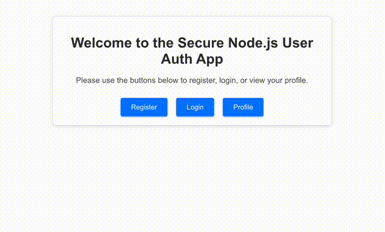

# 🔐 Secure Node.js User Auth App

A simple, secure, and modular user authentication system built with **Node.js**, **Fastify**, and **JWT**, designed around **OWASP Top 10 (2021)** best practices. This project demonstrates how to implement core authentication features securely while keeping the codebase clean, extensible, and Docker-ready.

---

## 🚀 Features

- 🔐 User registration & login with secure password hashing via `bcrypt`
- 🔑 JWT-based stateless session authentication
- ✅ Manual input validation with detailed error messages
- 🛡 HTTP security headers (simulating Helmet)
- 🔄 CSRF protection using `@fastify/csrf-protection`
- 🚫 Rate limiting with `@fastify/rate-limit`
- 📄 Secure and minimal error messages
- 📈 Security-aware logging for auth and profile access events
- 🧠 In-memory user store for development/demo purposes

---

## 🛡️ OWASP Top 10 Security Mapping

| Feature                                | OWASP Top 10 Risk                          |
|----------------------------------------|--------------------------------------------|
| Input validation in auth controller    | A03: Injection                             |
| Password hashing with bcrypt           | A02: Cryptographic Failures                |
| JWT-based session management           | A02, A07: Identification & Authentication  |
| Rate limiting                          | A05: Security Misconfiguration             |
| CSRF protection (token endpoint + cookie) | A01, A03, A10: Broken Access Control, Injection, SSRF |
| HTTP headers (X-Frame, X-Content-Type, etc.) | A05: Security Misconfiguration         |
| In-memory user store (dev only)        | A05, A08: Security Misconfiguration, Integrity Failures |
| Secure logs for login/profile events   | A09: Security Logging and Monitoring Failures |

---

## 📁 Project Structure

```txt
secure-nodejs-auth-app/
├── .github/workflows/
│   └── ci.yml                 # A simple CI pipeline to check server
├── controllers/
│   └── authController.js      # Handles registration and login logic
├── lib/
│   └── oauthClient.js         # OAuth client helper
├── models/
│   └── userStore.js           # In-memory user database
├── routes/
│   ├── auth.js                # /api/auth/login & /register endpoints
│   └── profile.js             # /api/profile (JWT protected)
├── frontend/                  # React frontend demo
│   ├── public/               # Static assets (favicon, manifest, etc.)
│   └── src/
│       ├── components/       # React UI components
│       ├── contexts/         # React context providers (e.g. AuthContext)
│       ├── pages/            # React pages (Home, Login, Profile, etc.)
│       ├── services/         # API service helpers
│       ├── App.js            # Main React app component
│       ├── index.js          # React app entry point
│       └── ...               # Other React source files
├── .env.example               # Example environment variables
├── app.js                     # Fastify server setup
├── Dockerfile                 # Containerized deployment definition
├── docker-compose.yml         # Multi-service orchestration
├── package.json               # Node dependencies and scripts
├── README.md                  # You're reading it!
├── healthcheck.sh             # A PING test for CI pipeline
├── test.py                    # Python script for testing endpoints
└── requirements.txt           # List of requirements for python test

````

---

## 📦 Dependencies

| Technology      | Purpose                          |
|----------------|----------------------------------|
| Node.js (v18+) | Main backend runtime             |
| Fastify        | High-performance server framework|
| bcryptjs       | Password hashing                 |
| jsonwebtoken   | Token-based session auth         |
| @fastify/csrf-protection | CSRF protection        |
| @fastify/cookie           | Cookie support         |
| @fastify/rate-limit       | Rate limiting          |
| pino-pretty     | Enhanced logging output         |
| dotenv          | Environment variable loading    |

---

## 🏁 Setup (Without Docker)

```bash
# 1. Clone the repo
git clone https://github.com/alipoosti/owasp-auth-node
cd secure-nodejs-auth-app

# 2. Create environment config
cp .env.example .env
# Fill in JWT_SECRET and COOKIE_SECRET with strong random values

# 3. Install dependencies
npm install

# 4. Start the server
npm start
````

Visit `http://localhost:3000/ping` to verify the app is running.

---

## 🐳 Run with Docker Compose

```bash
# Build and run the app
docker-compose up -d --build
```

This runs the server on `http://localhost:3000`, ready for testing.

---

## 🧪 Testing with Python

A minimal `test.py` script is provided to test registration and login endpoints.

```bash
pip install requirements.txt
python3 test.py
```

It demonstrates:

- Registering a user
- Logging in
- Storing and reusing JWT token
- Accessing a protected profile route

You can expand this script for full integration testing.

---

## ⚙️ CI Pipeline (GitHub Actions)

This project includes an automated **CI pipeline using GitHub Actions**, located in `.github/workflows/ci.yml`. Every time you **push to the `main` branch** or open a **pull request**, the following checks are performed:

- 🧪 Health check against `/ping` endpoint
- ✅ App launch verification
- 📦 Dependency install & build confirmation

### 🔍 How to View CI Results

1. Go to your GitHub repository.
2. Click the **“Actions”** tab at the top.
3. Select the latest workflow run titled **“Node.js CI”**.
4. Expand steps to view logs, output, and errors.

> ✅ You should see a success message confirming the `/ping` endpoint returned `{ "pong": true }`.

---

## 🔐 Security Notes

- This app is for **development, education, and prototyping**.
- For production:

  - Replace the in-memory `userStore` with a database (e.g. PostgreSQL, MongoDB).
  - Use HTTPS and set `secure: true` for all cookies.
  - Harden headers further (e.g. `Content-Security-Policy`).
  - Consider input schema validation libraries like `zod`, `Joi`, or `fastify-validator`.
  - Add RBAC/ABAC patterns for fine-grained access control.
  - Integrate OAuth 2.0 or OpenID Connect for federated authentication and social login options.
  
  ---

## 🧠 Future Enhancements

- Database persistence (Postgres or Mongo)
- OAuth2 / SSO integration
- Role-based authorization (RBAC)
- Unit and integration test suite
- Email verification & password reset flow
- Swagger/OpenAPI documentation

---
  
## 🆕 New Features

### Google OAuth Login

An option to use **Google OAuth** for user login has been added. This allows users to authenticate using their Google accounts, providing a convenient and secure alternative to traditional username/password login.

### React Frontend Demo

A **React frontend** has been added to demonstrate the app's functionality. This frontend provides a user-friendly interface for registration, login (including Google OAuth), and profile management.
You can see a demo of the frontend in action in the clip at [`Frontend.gif`](Frontend.gif).



---
  
## 📜 License

MIT – free to use, modify, and share.

---
